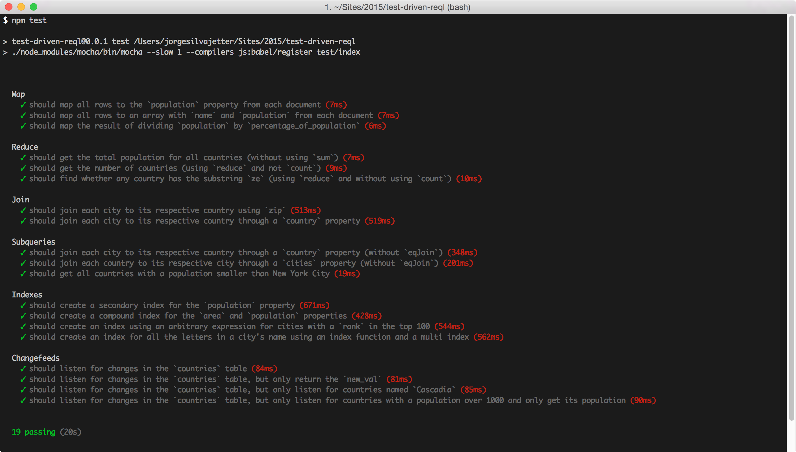

# Test Driven ReQL

*Learn ReQL+RethinkDB by making tests pass.*

Go from this:


To this:



## Setup

1. [Install RethinkDB](http://rethinkdb.com/install)

2. Install all dependencies

```
npm install
```

## Running Test Suite

In order to run the tests, just run `npm test`:

```
npm test
```
